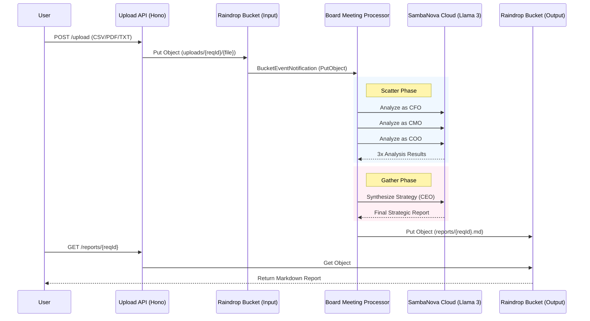

# Architecture Review: Virtual C-Suite

## 1. Executive Summary
The **Virtual C-Suite** application has been successfully remediated to align with the Product Requirement Document (PRD). The architecture now strictly follows the **Event-Driven "Scatter-Gather" pattern**, utilizing **LiquidMetal Raindrop Observers** for orchestration and **SambaNova Cloud** for high-performance AI inference. The dependency on SQL databases has been removed in favor of a pure object-storage state model.

## 2. Solution Architecture

The following diagram illustrates the implemented data flow:

## 3. Component Analysis

### 3.1 Ingestion Layer (`src/upload-api`)
*   **Technology**: Hono web framework.
*   **Functionality**: Handles file uploads and status polling.
*   **Compliance**: 
    *   Supports `application/pdf`, `text/csv`, `text/plain` (Matches PRD).
    *   Generates unique Request IDs.
    *   Stores files directly to `input-bucket`, triggering the event loop.
    *   **State Check**: Implements "File Existence as State" pattern. Checks `output-bucket` for completion and `input-bucket` for processing status, eliminating the need for a tracking database.

### 3.2 Orchestration Layer (`src/board-meeting-processor`)
*   **Technology**: Raindrop Observer.
*   **Trigger**: Configured in `raindrop.manifest` to listen to `input-bucket` `PutObject` events.
*   **Pattern**: Implements the "Scatter-Gather" pattern correctly.
    *   **Scatter**: Uses `Promise.all` to execute 3 parallel calls to SambaNova.
    *   **Gather**: Aggregates results and performs a final synthesis call.
*   **AI Model**: Configured to use `Meta-Llama-3.3-70B-Instruct` via the `SambaNova` SDK.

### 3.3 Persistence Layer
*   **Input**: `input-bucket` stores raw files.
*   **Output**: `output-bucket` stores final Markdown reports.
*   **Database**: No SQL database is used in the runtime logic.

## 4. PRD Compliance Checklist

| Requirement | Status | Implementation Details |
| :--- | :--- | :--- |
| **Instant Ingestion** | ✅ Compliant | Drag-and-drop supported via API accepting multiple formats. |
| **The "Board Meeting"** | ✅ Compliant | Parallel analysis by CFO, CMO, COO agents. |
| **Conflict Synthesis** | ✅ Compliant | AI-driven synthesis step implemented in `analysis-coordinator`. |
| **Action Plan Output** | ✅ Compliant | Generates `Strategy_Report.md`. |
| **SambaNova Integration** | ✅ Compliant | Uses SambaNova SDK for all inference. |
| **No SQL Database** | ✅ Compliant | Logic refactored to use Buckets only. |
| **Event-Driven** | ✅ Compliant | Uses Raindrop Observers and Bucket Notifications. |

## 5. Recommendations

1.  **Manifest Cleanup**: The `raindrop.manifest` file still contains a definition for `sql_database "tracking-db"`. While the code no longer uses it, this resource should be removed from the manifest to prevent unnecessary provisioning and strictly adhere to the "No SQL" architectural constraint.
2.  **Error Handling**: The current "File Existence" status check is efficient but assumes that if a file exists in input but not output, it is "processing". If the processor crashes silently, the status will remain "processing" indefinitely. Consider implementing a "Dead Letter Queue" or a simple error marker file (e.g., `errors/{reqId}.txt`) in the output bucket to handle failures more robustly.
